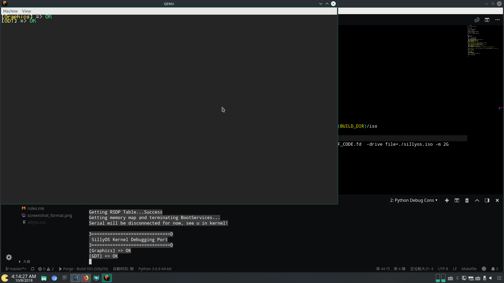

# SillyOS
Currently screenshot:


## WTF is this?
When a 14yo ignorance kid day dreaming, he always dream big, bigger than everything.
He decided to create an OS to prove himself,
so this warrior wasted 6+ years to learn about how the fuck can he code an OS.  

And now he still have no closer...

## :hammer:How do I build it?
1. Install needed packages
    * APT side:
        * nasm
        * build-essential
        * git (A MUST HAVE PACKAGE!)
        * make (I had tried tup, python, lua. And found out make is the best. :expressionless: )
        * mtools
        * xorriso
        * qemu (For testing)
        * ovmf (For UEFI Testing)
        * uuid-dev (EDK2)
        * python3 (I wrote script in Python3)
2. Build tools
```bash
# GCC
$ source ./Scripts/mkgcc.sh
# Clang
$ source ./Scripts/mkllvm.sh
```
3. Edit ```Config.mk```
4. Setup environment by ```source ./setup.h```
5. Type ``` make all ``` for full system compilation. 
6. Type ``` make qemu ``` emulate at host's qemu.

## :running:What do I need to run SillyOS?
Running on real machine:
* x86_64 machine
* UEFI bios supported (optional)
* DETERMINATION!

Running on VM:
1. make your own image file
    ```bash
    $ make efi_iso
    ```
2. use it on virtual machine (qemu, Virtual Box, VMWare etc.)

## :warning:Something goes wrong!
<details>
<summary>Getting error when building EDK2 tools?</summary>
<p>If you received errors like: 

```bash
In file included from ../Include/Common/UefiBaseTypes.h:19:0,
                 from GenSec.c:20:
    /*
        A lot of details here... Gonna skip it anyway.
        The following error told us why its failed.
        |   |   |   |   |   |   |   |   |
        v   v   v   v   v   v   v   v   v
    */
cc1: all warnings being treated as errors
../Makefiles/footer.makefile:27: recipe for target 'GenSec.o' failed
make[2]: *** [GenSec.o] Error 1
```

* Go patch your edk2 Makefile with:
```bash
$ patch  /<path of your edk2 dir>/BaseTools/Source/C/Makefiles/headers.makefile\
 /<path of your edk dir>/edk2_fix.patch
```
</p>
</details>

## :bulb:Milestone
<!--Boot loader-->
<details>
<summary>Boot Loader</summary>
<p>
    -   [x] Get the boot loader prints something<br>
    -   [x] Change video mode<br>
    -   [x] Get memory map<br>
    -   [x] Loading Kernel to RAM<br>
    -   [X] Loading ELF<br>
    -   [X] Get ACPI<br>
    -   [X] Pass control to Kernel with env. variables<br>
    -   [ ] Loading and install mods<br>
    -   [ ] Configuration mechanism<br>
</p>
</details>
<!--Platform-x86_64-->
<details>
<summary>Platform-x86_64</summary>
<p>
    -   [ ] Paging<br>
    -   [ ] Support Floating point<br>
    -   [ ] Port libc, libc++<br>
    -   [ ] Graphics<br>
    -   [ ] Disk<br>
    -   [ ] System Serial<br>
    -   [ ] USB<br>
</p>
</details>
<!--Core-->
<details>
<summary>Core</summary>
<p>
    -   [ ] 
</p>
</details>
<!--Modules-->
<details>
<summary>Modules</summary>
<p>
    -   [ ] Ready to write Modules<br>
</p>
</details>

Currently working on: ___Platform-x86_64___